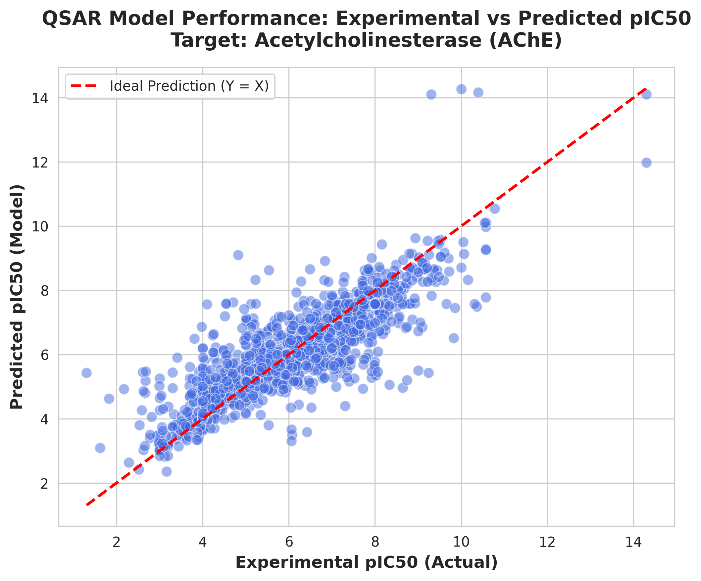

# AChE Inhibitor QSAR Machine Learning Pipeline

*Disclaimer: This is an independent portfolio project and is not connected to published research.*

This repository contains a comprehensive, end-to-end Machine Learning and Chemoinformatics pipeline designed to predict the bioactivity (pIC50) of chemical compounds targeting **Acetylcholinesterase (AChE)**. AChE is a primary therapeutic target for developing treatments against Alzheimer's disease.

The pipeline automates data retrieval, molecular feature engineering, robust regression modeling, and statistical evaluation.

---

## Pipeline Architecture & Workflow

1. **Data Collection**: Automated extraction of bioactivity data (IC50) for Human Acetylcholinesterase (`CHEMBL220`) from the ChEMBL database using the official web resource client.
2. **Data Preprocessing**: Stricter data filtering, conversion of standard string values to floats, dropping missing columns, and transforming IC50 values into a standardized logarithmic scale (pIC50 = -log10(IC50)).
3. **Feature Engineering**: Conversion of canonical SMILES strings into 2048-bit Morgan Fingerprints (radius = 2) utilizing RDKit to represent molecular structures numerically. 
4. **Model Training**: Implementation of a Random Forest Regressor (n_estimators=100) trained on an 80/20 train/test split.
5. **Evaluation & Visualization**: Performance tracking via R2 and RMSE metrics, backed by high-resolution scatter plots comparing experimental vs. predicted values.

---

## Model Performance Results
The trained Random Forest model demonstrated strong predictive capabilities on the unseen test dataset:

* **Total Checked Compounds:** 8,790 molecules
* **Dataset Structure:** 2,050 total columns
  * **Features:** 2,048 Morgan fingerprint bits (used for training)
  * **Identifier:** 1 column (`molecule_chembl_id`)
  * **Target:** 1 column (`pIC50`)
* **R-squared (R2) Score:** 0.722
* **RMSE (Root Mean Squared Error):** 0.815

### Experimental vs. Predicted pIC50
Below is the correlation plot generated by the visualization script, showcasing the model's accuracy against the ideal prediction diagonal (Y = X):



---

### 1. Prerequisites

Ensure you have the required chemical informatics and machine learning stack installed:

```bash
pip install chembl_webresource_client pandas numpy rdkit scikit-learn matplotlib seaborn
```

### 2. Execution Steps

Execute the scripts sequentially to regenerate the model from scratch:

```bash
python 01_data_collection.py
python 02_feature_engineering.py
python 03_model_training.py
python 04_visualization.py
```

## Scientific Context & References

- **ChEMBL Database:** Gaulton, A. et al. *ChEMBL: a large-scale bioactivity database for drug discovery.* Nucleic Acids Research, 40(D1), D1100–D1107 (2012).

- **RDKit:** Open-source cheminformatics software toolkit. https://www.rdkit.org

- **Random Forest in QSAR:** Svetnik, V. et al. *Random Forest: a classification and regression tool for quantitative structure-activity relationship modeling.* Journal of Chemical Information and Computer Sciences, 43(6), 1947–1958 (2003).
